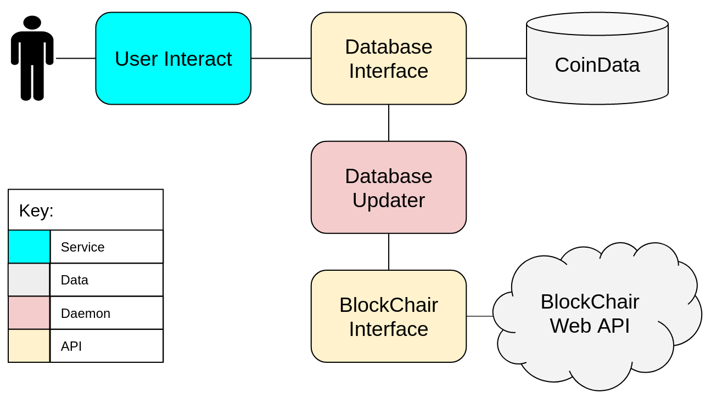

# coinTrackCase

  
   
  <i>System Architecture.</i>

For specific details and overview about system look at:  
https://www.notion.so/Marcus-Dominguez-Kuhne-b064291cc1fa43fd96ab10d0db0952c8

NOTE: The database for this system runs on an AWS RBS mySQL instance, which we access through an AWS EC2 Ubuntu instance. Keep pem key local in this repository for access.  We can access the AWS RBS mySQL instance from anywhere, but it's just easiest through AWS EC2 due to Amazon group permissions.

To log into this instance:
1. cd AWS_DB_Logistics
2. ssh -i aws_ec2.pem ubuntu@ec2-13-52-80-55.us-west-1.compute.amazonaws.com
  Note: May need to run for key permissions: chmod 600 aws_ec2.pem

To start and run the database (after logging in):
1. conda activate coin
2. cd Projects/coinTrackCase
3. Initialize database and empty tables:  
python setup_mysql_server.py
3. Start Database Updater to run continuously in own window:  
python db_updater.py
4. Start user interact, note that main function runs demo for us, but we can change to be more user interactive:  
python user_interact.py
